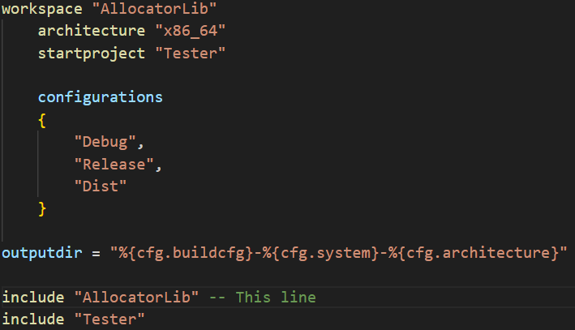
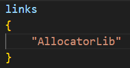
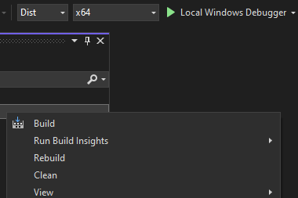

Allocator Library (ALL)
=======================
AllocatorLib is a simple allocator providing custom std types. These custom types can show uplifts in performance of up to 100% compared to std types.

# Getting Started
ALL uses premake as it's build system. To build ALL Windows is recommended, however building for linux is possible.

To get started clone this repository.

## Building ALL for Windows:

<ins>**Option 1 - Integrate ALL into an existing premake project:**</ins>

1. To integrate ALL in to a project, inclusion of [premake5.lua](AllocatorLib/premake5) located in the `AllocatorLib` folder is needed. Do this by inserting `include "path/to/library/AllocatorLib"` into the projects workspace file. Note: Do not include the [premake5.lua](premake5.lua) file located in the root directory of this project.

2. Now add a `links {"AllocatorLib"}` statement into the premake project file in which ALL should be used in.

3. Reload your premake project and everything should be up and ready.

<ins>**Option 2 - Building ALL staticly using Visual Studio:**</ins>

1. Execute [Setup-Visual-Studio.bat](Scripts/Setup-Visual-Studio.bat) located in the `Scripts` folder. This will generate a Visual Studio solution file.
2. Open the solution file and make sure to selct Dist for the building configuration. Then right click on the AllocatorLib project and select build.

4. There will be a static library generated in the `bin/Dist-windows-Your-Computer-Architecture/AllocatorLib` folder.

<ins>**Option 3 - Building ALL staticly using make:**</ins>

1. Execute [Setup-Visual-Studio.bat](Scripts/Build-AllocatorLib.bat) located in the `Scripts folder`. This will generate a static library in `bin/Dist-windows-Your-Computer-Architecture/AllocatorLib`. Note: Building ALL this way requires make and gcc to be installed.

## Building ALL for Linux:

1. Execute [Setup-Visual-Studio.bat](Scripts/Build-AllocatorLib.bat) located in the `Scripts folder`. This will generate a static library in `bin/Dist-linux-Your-Computer-Architecture/AllocatorLib`. Note: Building ALL this way requires make and gcc to be installed.

# The Plan

I mainly created this project because I wanted to see how custom allocators work and as I went through the process of creating this project I found myself having a lot of fun writing low level data types and allocators. The plan is to expand this project adding more data types and diffrent allocators.

### Features to come

- Custom Tpyes: HashMap, HashSet, String
- ArenaAllocator
- Allocator support for std types

